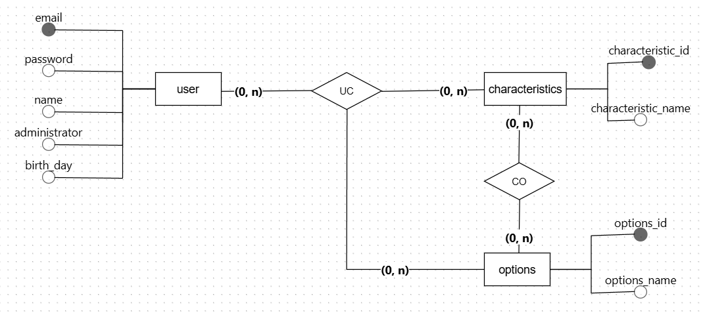

### 🔥 **Tinder Web - Projeto Laravel com ADMIN LTE**  

Bem-vindo ao **Tinder Web**, meu primeiro projeto desenvolvido em Laravel com um painel administrativo baseado no **AdminLTE**! 

---

## 🌟 **Objetivo**  
Criar uma versão web do **Tinder**, onde os usuários podem:  
1. Cadastrar-se e preencher informações pessoais.  
2. Definir suas preferências.  
3. Avaliar e interagir com cards de outros usuários.  
4. Descobrir matches e ser notificado com um som especial quando ocorrer!  

---

## **🎯 Backlog do Produto**

| **Rank** | **ID**  | **User Story** | **Estimativa** | **Sprint** |
|----------|---------|----------------|----------------|------------|
| 01 | TW - 01 | Como um usuário, eu quero me cadastrar com e-mail e senha e preenchendo cinco campos sobre minhas características pessoais para começar a usar o sistema e ser apresentado aos outros usuários. | 2 | 1 |
| 02 | TW - 02 | Como um usuário, eu quero definir minhas preferências com base nos cinco campos cadastrados para encontrar perfis compatíveis. | 2 | 1 |
| 03 | TW - 03 | Como um usuário, eu quero poder fazer login utilizando meu e-mail e senha para acessar a plataforma de forma rápida e segura. | 1 | 1 |
| 04 | TW - 04 | Como um administrador, eu quero acessar um painel com tabelas dinâmicas para visualizar os usuários cadastrados e os matches. | 3 | 2 |
| 05 | TW - 05 | Como um usuário, eu quero visualizar cards de outros usuários e indicar se gostei ou não para iniciar a interação. | 3 | 2 |
| 06 | TW - 06 | Como um usuário, eu quero ser notificado com um som especial quando der match com outro usuário. | 2 | 2 |
| 07 | TW - 07 | Como um administrador, eu quero visualizar gráficos de pizza baseados nas cinco informações cadastradas pelos usuários para análise. | 2 | 3 |
| 08 | TW - 08 | Como um usuário, eu quero acessar um menu superior para visualizar meus matches. | 1 | 3 |
| 09 | TW - 09 | Como um administrador, eu quero gerenciar os dados dos usuários para controlar os dados da plataforma. | 3 | 3 |
| 10 | TW - 10 | Como um usuário, eu quero poder mudar minha senha para garantir segurança ao meu acesso. | 2 | 4 |

---

# Diagrama de entidades de relacionamento do banco de dados

---
## 🗺️ Cronograma do Projeto

| Fase                   | Início         | Entrega        | Status  |
|------------------------|----------------|----------------|---------|
| Kick off do projeto    | 07/01/2025     | 07/01/2025     | ✅ |
| Sprint 1               | 07/01/2025     | 13/01/2025     | 🔄 |
| Sprint 2               | 14/01/2025     | 20/01/2025     |  |
| Sprint 3               | 21/01/2025     | 27/01/2025     |  |
| Sprint 4               | 28/01/2025     | 03/02/2025     |  |

---

## 🛠️ **Tecnologias Utilizadas**  
- **Framework**: [Laravel](https://laravel.com/)  
- **Interface do Painel**: [AdminLTE](https://adminlte.io/)  
- **Autenticação**: [Laravel Authentication](https://laravel.com/docs/11.x/authentication)  
- **Tabelas interativas**: [Datatables](https://datatables.net/)  
- **Gráficos dinâmicos**: [Highcharts](https://www.highcharts.com/)  
- **Banco de Dados**: [MySQL](https://www.mysql.com/)  
- **Containerização**: [Docker](https://www.docker.com/)  
- **Editor de Código**: [Visual Studio Code](https://code.visualstudio.com/)  
